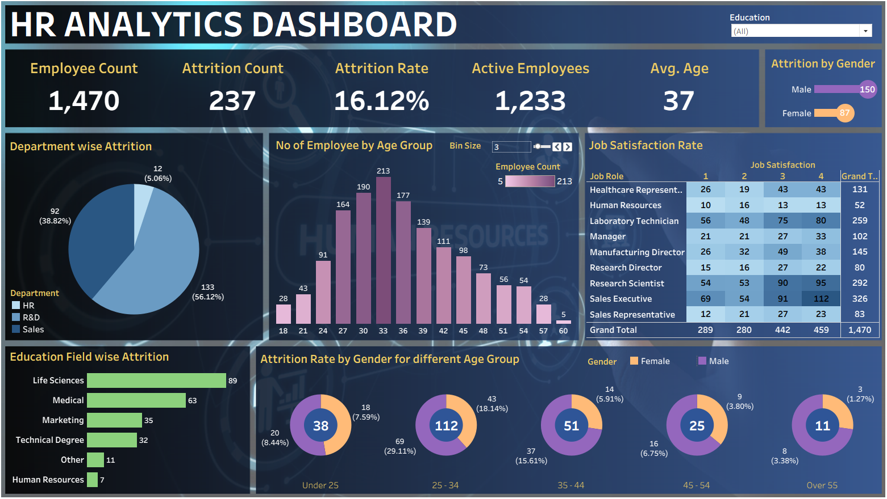
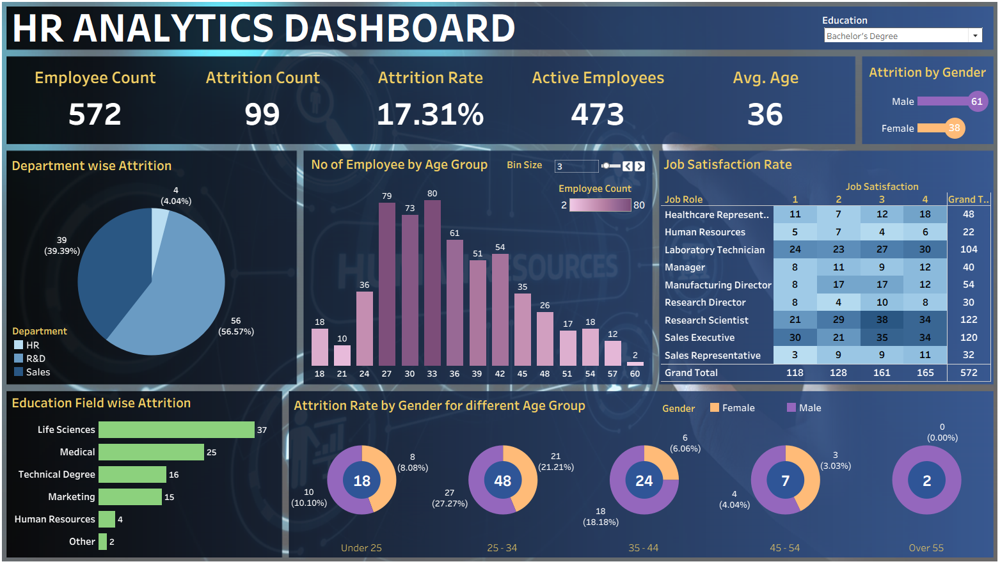

# HR Analytics Dashboard | Tableau

## 📌 Overview
This project presents an interactive **HR Analytics Dashboard** developed using **Tableau** to analyze employee data and uncover insights related to attrition, workforce demographics, and job satisfaction.

The dashboard transforms raw HR data into meaningful insights that help organizations improve employee retention and support data-driven decision-making.

---

## 🎯 Objectives
- Analyze employee attrition trends  
- Identify key factors influencing employee turnover  
- Understand workforce demographics  
- Evaluate job satisfaction across different roles  
- Support strategic HR decision-making  

---

## 📊 Key Performance Indicators (KPIs)
- **Total Employees:** 1,470  
- **Attrition Count:** 237  
- **Attrition Rate:** 16.12%  
- **Active Employees:** 1,233  
- **Average Age:** 37  

---

## 📈 Dashboard Features
- Department-wise attrition analysis  
- Employee distribution by age group  
- Education field-wise attrition  
- Gender-based attrition comparison  
- Job satisfaction analysis by job role  
- Interactive filters for dynamic exploration

---

## 🔍 Key Insights
- The **Sales department** has the highest attrition rate  
- Most employees belong to the **25–34 age group**  
- Higher attrition is observed in **Life Sciences and Medical fields**  
- **Male employees** show slightly higher attrition than females  
- Job satisfaction levels vary across job roles

---

## 💡 Business Value
- Helps reduce employee attrition  
- Improves workforce planning  
- Identifies high-risk employee segments  
- Enhances HR decision-making with data insights  

---

## 🛠️ Tools
- Tableau  
- Excel
  
---

## 📊 Dashboard Preview

